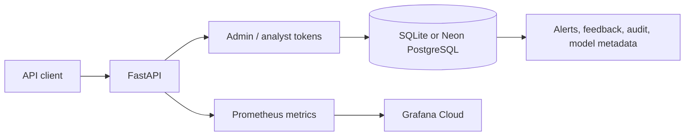

<p align="center">
  
</p>

<h1 align="center">Amastan Fraud Shield</h1>

<p align="center">
  A fraud alert review API for Tunisian digital payments,<br>
  live on Hugging Face Spaces with Neon PostgreSQL and Grafana Cloud.
</p>

<p align="center">
  <a href="https://github.com/ReguiguiMohamed/amastan-fraud-shield/actions/workflows/ci.yml"></a>
</p>

<p align="center">
  <a href="https://reguiguimohamed.github.io/amastan-fraud-shield/"><b>Try the demo</b></a> ·
  <a href="https://huggingface.co/spaces/MohamedReg/amastan-fraud-shield-api">Live API</a> ·
  <a href="docs/API_REFERENCE.md">API reference</a> ·
  <a href="docs/DEPLOYMENT.md">Deployment</a> ·
  <a href="https://github.com/ReguiguiMohamed/amastan-fraud-shield/releases/latest">Release</a>
</p>

<br>

Amastan stores fraud alerts for Tunisian digital payments and gives analysts a
queue to review them. Each verdict is kept as feedback. Reviewed cases export
for CTAF filing, and important changes land in an audit trail.

Two bearer tokens split the work. The admin token ingests alerts and exports
cases, and the analyst token reads the queue and submits feedback. The same
code runs on SQLite locally and on Neon PostgreSQL in the hosted demo.

> [!NOTE]
> The project is finished and in maintenance mode.

## How it works



1. **A client** posts an alert to `/api/v1/alerts/add/` with the admin token.
2. **FastAPI** stores it in SQLite locally or in Neon PostgreSQL on the Space.
3. **An analyst** reads the review queue and records a verdict through
   `/api/v1/feedback/`.
4. **The API** tracks model metadata and training outcomes, and reports drift
   and review metrics.
5. **Grafana Cloud** scrapes `/metrics` with its own token.

This repository holds that deployed slice only. Earlier Kafka, Spark,
Streamlit, Ollama, ChromaDB, Kubernetes and local monitoring experiments were
removed during the final cleanup.

## Demo

The [demo site](https://reguiguimohamed.github.io/amastan-fraud-shield/)
scores a payment with the API's rules, raises an alert above the threshold and
shows the CTAF filing deadline. It also shows live CI, deploy and Space status.
`test_site_rules_match_python` keeps its rules equal to the Python ones.

## Proof

The hosted API, an authenticated Swagger request, and the same alert in Neon
PostgreSQL:


The Grafana Cloud dashboard and the metric query behind it:


The dashboard export is [`docs/grafana-dashboard.json`](docs/grafana-dashboard.json).

## Endpoints

| Method | Path | Purpose |
|---|---|---|
| `GET` | `/health/` | Health and version |
| `POST` | `/api/v1/alerts/add/` | Store an alert |
| `GET` | `/api/v1/alerts/review-queue/` | Read the review queue |
| `POST` | `/api/v1/feedback/` | Record analyst feedback |
| `GET` | `/api/v1/stats/` | Review statistics |
| `GET` | `/api/v1/compliance/kpis/` | Compliance indicators |
| `GET` | `/api/v1/model/training-summary` | Model training history |
| `GET` | `/metrics` | Prometheus metrics |

Swagger is served at `/docs`. The [API reference](docs/API_REFERENCE.md) lists
every route.

## Run locally

Python 3.11 or 3.12 is required.

```powershell
python -m pip install -r requirements-dev.txt

$env:ADMIN_TOKEN = "local-admin"
$env:ANALYST_TOKEN = "local-analyst"
$env:DATABASE_URL = "sqlite:///./data/feedback.db"

python -m uvicorn dashboard.api:app --reload --port 8001
```

Open `http://localhost:8001/docs`.

## Tests

```powershell
$env:PYTEST_DISABLE_PLUGIN_AUTOLOAD = "1"
python -m pytest tests -q
ruff format --check src dashboard scripts tests
ruff check src dashboard scripts tests
bandit -r src dashboard scripts -lll
```

## Automation

Dependabot patch and minor updates merge on their own once CI passes. Major
updates stay open with a `semver-major` label. A failed health check, deploy,
security scan or Pages run on `main` opens one issue, and the next green run
closes it.

| Workflow | Trigger | What it does |
|---|---|---|
| [CI](.github/workflows/ci.yml) | Push to `main`, pull request, manual | Ruff, zizmor, tests with 70% coverage, OpenAPI snapshot, backtest artifact, Schemathesis against Postgres, Bandit gate, Docker build |
| [Deploy](.github/workflows/deploy.yml) | Push to `main` that changes the image, manual | Pushes the API to the Space and waits for the build |
| [Dependabot](.github/workflows/dependabot.yml) | Dependabot pull request, CI run | Labels updates and merges patch and minor ones after CI passes |
| [Health check](.github/workflows/health-check.yml) | Daily at 07:17 UTC, manual | Calls `/health/` unless the Space sleeps |
| [Weekly Security Report](.github/workflows/security-scan.yml) | Mondays at 06:00 UTC, manual | pip-audit, plus Semgrep and Bandit results to code scanning |
| [Failure issues](.github/workflows/failure-issues.yml) | Health check, deploy, security scan or Pages run on `main` | Opens, comments on or closes one issue per workflow |
| [Release](.github/workflows/release.yml) | `v*` tag | Creates the GitHub release from [CHANGELOG.md](CHANGELOG.md) |
| [Pages](.github/workflows/pages.yml) | Push to `main` that changes `site/` or the proof screenshots, manual | Publishes the interactive demo to GitHub Pages |

## Repository

| Path | Contents |
|---|---|
| [`dashboard/`](dashboard/) | FastAPI app and analytics |
| [`src/compliance/`](src/compliance/) | Filing deadlines and change audit |
| [`src/ml/`](src/ml/) | Model lifecycle persistence |
| [`src/shared/`](src/shared/) | Database, logging, risk config, version |
| [`site/`](site/) | Interactive demo for GitHub Pages |
| [`scripts/`](scripts/) | OpenAPI and backtest utilities |
| [`tests/`](tests/) | API, domain and demo rule tests |
| [`docs/`](docs/) | API reference, deployment, OpenAPI, Grafana evidence, logo |

## Before production

- Rotate every token.
- Rehearse schema changes against PostgreSQL.
- Define backups and retention.
- Replace static bearer tokens with managed identity.
- Validate legal and reporting rules with the responsible institution.

## Built with

Python 3.11, FastAPI, SQLAlchemy, Neon PostgreSQL, the Prometheus client,
Grafana Cloud, Docker on Hugging Face Spaces, GitHub Actions and GitHub Pages.

Thanks to [Ruff](https://github.com/astral-sh/ruff) by Astral Software,
[Schemathesis](https://github.com/schemathesis/schemathesis) by Dmitry Dygalo
and [zizmor](https://github.com/zizmorcore/zizmor) by William Woodruff, all
MIT licensed.

## License

[MIT](LICENSE). Built by [Mohamed Reguigui](https://github.com/ReguiguiMohamed).
